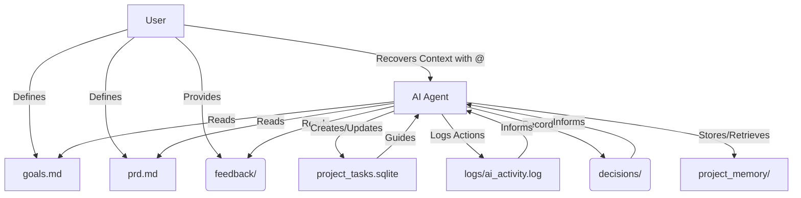

# 🚀 .gemini_project/ - Your AI-Powered Project Management Hub

This directory is the central nervous system for the AI agent managing this project. It serves as its persistent memory and operational base, ensuring the AI always has the necessary context and guidance, even across sessions or after memory resets.

---

## 🧠 Understanding the AI's Workspace: What's Inside?

This hub contains all the structured information the AI needs to comprehend, plan, and execute tasks for your project. Each component plays a vital role in maintaining project continuity and intelligence:

*   **`goals.md`**: Defines the overarching objectives and long-term vision for the project.
*   **`prd.md`**: The definitive Product Requirements Document, detailing the "what" and "why" of the features to be built.
*   **`feedback/`**: A dedicated space for your input.
    *   `likes/`: Store positive feedback and preferred approaches.
    *   `dislikes/`: Document areas for improvement or undesirable outcomes.
*   **`decisions/`**: A chronological log of significant architectural and design choices made throughout the project's lifecycle.
*   **`logs/ai_activity.log`**: A detailed, chronological record of all actions and thought processes undertaken by the AI.
*   **`project_tasks.sqlite`**: The core of the project's Kanban system. This SQLite database manages all tasks, their statuses (todo, in_progress, done), priorities, and dependencies.
*   **`project_memory/`**: Houses the local vector store, enabling the AI to perform advanced semantic searches across all project-related content for deep, long-term memory recall.



---

## 🤝 Your Role: Interacting with the AI & the Project Hub

The AI is designed to primarily interact with these files and databases. Your key interactions will involve:

1.  **Project Definition**: Collaborate with the AI to populate `goals.md` and `prd.md`. These documents are crucial for guiding the AI's understanding and planning.
2.  **Progress Monitoring**:
    *   Review `logs/ai_activity.log` to track the AI's work and progress.
    *   Utilize the AI to query `project_tasks.sqlite` for real-time updates on task statuses.
    *   Inspect code changes and other outputs generated by the AI.
3.  **Continuous Feedback**: Actively provide feedback by creating new Markdown files within `feedback/likes/` or `feedback/dislikes/`. This helps the AI adapt and align with your preferences.
4.  **Decision Logging**: Document all significant project decisions by creating new files in the `decisions/` directory. This provides essential context for future AI actions.
5.  **Context Recovery (Crucial for AI Memory Reset)**: If the AI's internal memory is cleared (e.g., new session, context window reset), you can swiftly re-establish its understanding by referencing key files from this directory using the `@` symbol in your initial prompt.

    **Example Recovery Prompt:**
    ```
    I'm working on [Your Project Name]. Here's the context:
    @.gemini_project/goals.md
    @.gemini_project/prd.md
    @.gemini_project/project_tasks.sqlite
    @.gemini_project/logs/ai_activity.log
    ```
    *(Note: For `project_tasks.sqlite`, the AI will use its internal tools to query the database, not display its raw binary content.)*

---

## ✅ Prerequisites: What You Need

To ensure seamless operation of this AI-powered project management system, please ensure the following are in place:

*   **`sqlite3` Command-Line Tool**: Essential for the AI to manage the `project_tasks.sqlite` database.
*   **Markdown Familiarity**: A basic understanding of Markdown syntax will be beneficial for directly editing the `.md` files.
*   **Gemini CLI `@` Symbol**: Familiarity with using the `@` symbol to efficiently load project context into the AI's active memory.

This comprehensive guide, alongside the `GEMINI.md` file, establishes a robust and persistent workflow for highly effective AI-assisted development.
