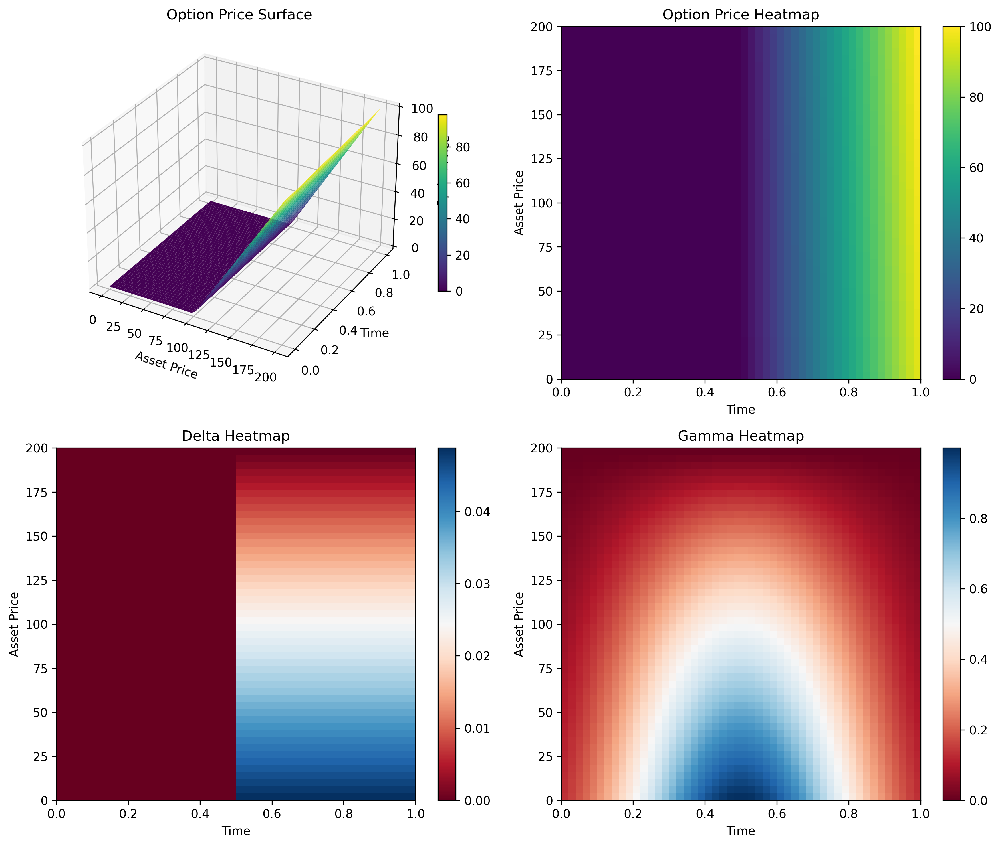

# Unified Multi-Dimensional PDE Option Pricing Framework

[](https://github.com/PLACEHOLDER/finite_difference_options/actions/workflows/ci.yml)

A comprehensive framework for pricing financial derivatives using finite difference methods to solve partial differential equations (PDEs). Supports both 1D and multi-dimensional stochastic processes through a unified interface.



## Features

### Core Framework
- **Unified Interface**: Single API for 1D and multi-dimensional processes
- **Domain-Focused Architecture**: Clean separation between processes, pricing, solvers, and utilities
- **Extensible Design**: Easy to add new stochastic processes and financial instruments
- **Type Safety**: Comprehensive dataclasses and NumPy typing throughout

### Stochastic Processes
- **Affine Models**: Geometric Brownian Motion, Ornstein-Uhlenbeck, Cox-Ingersoll-Ross, Heston
- **Non-Affine Models**: Constant Elasticity of Variance (CEV), SABR
- **Multi-Dimensional Support**: Heston stochastic volatility, basket options, correlation modeling
- **Vectorized Computation**: Efficient batch evaluation of drift and covariance

### Pricing Capabilities
- **European Options**: Calls and puts with unified interface
- **Basket Options**: Multi-asset derivatives with flexible weighting
- **Greeks Computation**: Delta, Gamma, Theta, Vega via finite differences
- **ADI Solver**: Alternating Direction Implicit method for multi-dimensional PDEs

### Development & Quality
- **Robust Validation**: Comprehensive parameter and input validation
- **Error Handling**: Domain-specific exceptions with clear messages
- **Testing**: Extensive test suite covering all components
- **CI/CD**: Linting (`ruff`), type checking (`mypy`), and automated testing (`pytest`)

### Visualization & APIs
- **Streamlit Demo**: Interactive web application for exploring option prices and Greeks
- **FastAPI Service**: REST API for pricing, Greeks, and full PDE solution data
- **Full PDE Solution Data**: API endpoint returning 2D grids for frontend visualization

## Installation

```bash
pip install -r requirements.txt
```

For development with linting and test tools:

```bash
pip install -r requirements.txt -r requirements-dev.txt
```

## Quick Start

### Basic European Option Pricing

```python
import numpy as np
from src.processes import create_black_scholes_process
from src.pricing import create_unified_european_call, create_unified_pricing_engine, create_log_grid

# Create Black-Scholes process
process = create_black_scholes_process(risk_free_rate=0.05, volatility=0.2)

# Create European call option
option = create_unified_european_call(strike=100.0, maturity=0.25)

# Create pricing engine
engine = create_unified_pricing_engine(process)

# Create spatial grid
grid = create_log_grid(s_min=50.0, s_max=150.0, n_points=101)

# Price the option
prices = engine.price_option(option, grid)
print(f"Option price at S=100: {prices[50]:.4f}")
```

### Multi-Dimensional Heston Model

```python
import numpy as np
from src.processes import create_standard_heston
from src.pricing import create_unified_european_call, create_unified_pricing_engine

# Create Heston stochastic volatility model
heston = create_standard_heston()

# Create pricing engine for 2D process
engine = create_unified_pricing_engine(heston)

# Create option and grids
option = create_unified_european_call(strike=100.0, maturity=0.25)
s_grid = np.linspace(50.0, 150.0, 51)   # Stock price grid
v_grid = np.linspace(0.01, 0.5, 26)     # Volatility grid

# Price with 2D process
prices = engine.price_option(option, s_grid, v_grid)
print(f"2D Heston option prices shape: {prices.shape}")
```

### Basket Options

```python
import numpy as np
from src.processes import create_standard_heston
from src.pricing import create_unified_basket_call, create_unified_pricing_engine

# Multi-asset basket option
strikes = np.array([100.0, 110.0])
weights = np.array([0.6, 0.4])
basket = create_unified_basket_call(strikes, weights, maturity=0.25)

# Use 2D process for basket
process = create_standard_heston()
engine = create_unified_pricing_engine(process)

# Price basket option
s1_grid = np.linspace(80.0, 120.0, 21)
s2_grid = np.linspace(90.0, 130.0, 21)
prices = engine.price_option(basket, s1_grid, s2_grid)
```

## Development

Install the development tools and activate the pre-commit hooks:

```bash
pip install -r requirements.txt -r requirements-dev.txt
pre-commit install
```

Run formatting, linting and tests in one go:

```bash
pre-commit run --all-files
```

## Streamlit Demo

Launch an interactive application to explore option prices:

```bash
streamlit run apps/streamlit_app.py
```

In the app you can switch plotting backends between Matplotlib and Plotly.
Plotly is optional but recommended for interactivity (requirements already pin
`plotly>=6.3,<7`).

## Command-line Interface

Use [Typer](https://typer.tiangolo.com/) commands for quick pricing and plotting:

```bash
python -m cli price --option-type Call --strike 1 --maturity 1 --s0 1 --rate 0.05 --sigma 0.2
python -m cli plot --option-type Call --strike 1 --maturity 1 --output plot.png
```

## FastAPI Service

Start a REST API that exposes pricing and Greek calculations.
The service allows cross-origin requests from `https://your-domain.com`.

```bash
uvicorn api.main:app --reload
```

Endpoints:

- `POST /price` → `{ "price": float }`
- `POST /greeks` → `{ "delta": float, "gamma": float, "theta": float }`
- `POST /pde_solution` → Full 2D grids for prices and Greeks visualization
- `POST /reports/crif` → `{ "crif": str }`
- `POST /reports/cuso` → `{ "status": str }`
- `POST /reports/basel` → `{ "status": str }`
- `POST /reports/frtb` → `{ "status": str }`

## Next.js Client

A minimal client in `nextjs-client/` demonstrates how to call the API from the browser:

```bash
cd nextjs-client
npm install
npm run dev
```

It expects the FastAPI server to run locally on port 8000.

## Architecture

### Package Structure

```
src/
├── processes/          # Stochastic process implementations
│   ├── base.py        # Abstract interfaces (StochasticProcess, AffineProcess, NonAffineProcess)
│   ├── affine.py      # Affine models (GBM, OU, CIR, Heston)
│   └── nonaffine.py   # Non-affine models (CEV, SABR)
├── pricing/           # Financial instruments and pricing engines
│   ├── instruments/   # Option and derivative definitions
│   └── engines/       # Unified pricing engine with auto-solver selection
├── solvers/           # PDE solvers
│   └── adi.py        # Alternating Direction Implicit solver
└── utils/             # Shared utilities
    ├── process_validators.py  # Parameter validation
    ├── covariance_utils.py   # Matrix operations
    └── state_handling.py     # Array processing
```

### Key Design Principles

- **Unified Interface**: Single API for 1D and multi-dimensional processes
- **Covariance Parameterization**: Uses covariance matrices for PDE formulation
- **Domain Separation**: Clean boundaries between processes, pricing, and solving
- **Factory Functions**: Convenient creation of common model configurations
- **Type Safety**: Comprehensive dataclasses and NumPy typing
- **Extensible Architecture**: Strategy pattern and factory methods for easy extension

## Available Models

### 1D Processes
- **Geometric Brownian Motion**: `create_black_scholes_process(r, σ)`
- **Ornstein-Uhlenbeck**: `create_vasicek_process(r, κ, θ, σ)`
- **Cox-Ingersoll-Ross**: `create_cir_process(κ, θ, σ)`

### Multi-Dimensional Processes
- **Heston Model**: `create_standard_heston()` (2D: stock + stochastic volatility)
- **CEV Model**: `create_cev_process(μ, σ, β)` (1D with elasticity)
- **SABR Model**: `create_sabr_model(α, β, ρ, ν)` (2D: forward + volatility)

## Documentation

- **Mathematical Foundation**: [docs/explanation/black_scholes_fdm.md](docs/explanation/black_scholes_fdm.md)
- **PDE Models**: [docs/explanation/pde_models.md](docs/explanation/pde_models.md)
- **Regulatory Notes**: [docs/regulatory.md](docs/regulatory.md)
- **Architecture Decisions**: [docs/adr/](docs/adr/)
- **Refactoring Summary**: [REFACTOR_SUMMARY.md](REFACTOR_SUMMARY.md)

## License

MIT
