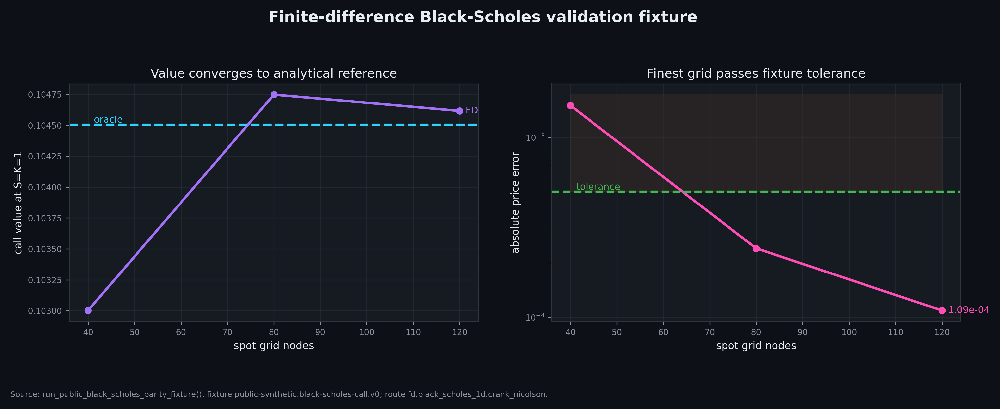
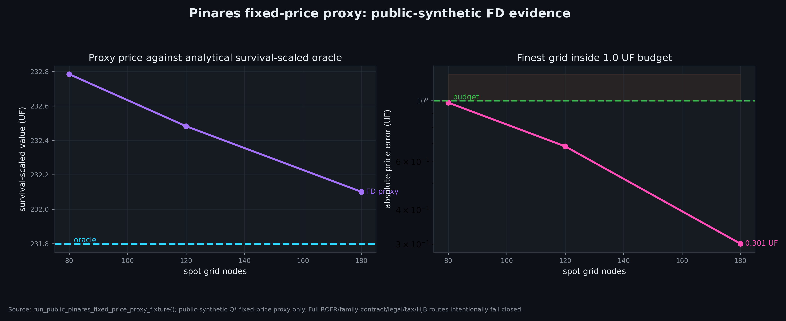

# Finite Difference Options

[](https://github.com/googa27/finite_difference_options/actions/workflows/ci.yml)

Finite Difference Options is an installable finite-difference toolkit for option-pricing PDE validation. It focuses on explicit coefficients, grids, boundary algebra, theta/ADI/LCP policies, Greeks and diagnostics. Public capability claims are governed by [docs/CAPABILITY_MATRIX.md](docs/CAPABILITY_MATRIX.md); unsupported routes must fail closed instead of returning plausible placeholder values.

Python support is intentionally narrow for this checkout: Python 3.12 only (at least 3.12 and below 3.13).

## Validation evidence snapshot





Generated by `uv run --with matplotlib==3.10.3 --with pillow==11.3.0 python scripts/generate_readme_validation_visuals.py`; the deterministic JSON visual QA and provenance report is written to `docs/images/readme_visual_provenance.json`.

Evidence used:

| Fixture | Route | Result |
|---|---|---|
| `public-synthetic.black-scholes-call.v0` | `fd.black_scholes_1d.crank_nicolson` | final price error `1.09e-4` versus `5.0e-4` tolerance; Delta/Gamma checked against analytical references |
| `public-synthetic.pinares-fixed-price-proxy.v1` | `fd.pinares_fixed_price_proxy.crank_nicolson` | final public-synthetic proxy error `0.301 UF` versus `1.0 UF` budget; full-family-contract, ROFR, legal/tax, jump and HJB routes fail closed |

The Pinares figure is not private project data and is not a real-estate legal/tax valuation. It is a deterministic one-dimensional fixed-price purchase-option proxy under the public `Q*` convention.

## What is validated now

| Capability | Maturity | Evidence |
|---|---|---|
| 1D Black-Scholes European call values and vanilla boundaries | validated | `BS-CALL-PARITY-V0`, `QPS-VANILLA-CALL-V0`, `BOUNDARY-MODEL-AWARE-V0` |
| Uniform/log/nonuniform grid contracts and requested-coordinate Greeks | validated | `GRID-LOCAL-METRICS-V0`, `FD-GREEKS-NONUNIFORM-V0`, `FD-GREEKS-VALIDATION-V0` |
| Rannacher startup for kinked payoffs | validated | `RANNACHER-GAMMA-V0` |
| Pinares fixed-price public proxy | validated | `PINARES-FD-FIXED-PRICE-PROXY-V0`, `PINARES-QPS-FIXED-PRICE-PROXY-V0` |
| 1D Black-Scholes/GBM American/Bermudan obstacle reference route | validated | `AMERICAN-LCP-V0` |
| Heston ADI vanilla route and multidimensional ADI | experimental | smoke/oracle/operator-split evidence only; no production calibration claim |
| Basket payoff over non-tradable factors, jumps, HJB/control and regulatory reports | unsupported/scaffold | fail-closed diagnostics before numerical work |

See [docs/BENCHMARK_REGISTRY.md](docs/BENCHMARK_REGISTRY.md), [docs/ARCHITECTURE.md](docs/ARCHITECTURE.md) and [docs/PRD.md](docs/PRD.md) for the complete evidence and architectural contract.

## Installation

Use Python 3.12:

```bash
python3.12 -m pip install .
```

Optional profiles are published as extras and kept outside the numerical core: `api`, `cli`, `ui`, `viz`, `validation`, `build`, `audit`, and `dev`.

For development gates:

```bash
python3.12 -m pip install -e '.[dev]'
python3.12 -m pip check
```

`requirements.txt` and `requirements-dev.txt` are legacy mirrors. `requirements-dev.lock.txt` is the pinned reproducible development/audit lock.

## Quick start

### Validated Black-Scholes European call smoke example

```python
import numpy as np
from finite_difference_options.processes import create_black_scholes_process
from finite_difference_options.pricing import create_unified_european_call, create_unified_pricing_engine, create_log_grid

process = create_black_scholes_process(mu=0.05, sigma=0.2)
option = create_unified_european_call(strike=100.0, maturity=0.25)
engine = create_unified_pricing_engine(process)

grid = create_log_grid(s_min=50.0, s_max=150.0, n_points=101, center=100.0)
times = np.linspace(0.0, option.maturity, 12)
prices = engine.price_option(option, grid, time_grid=times)

spot_idx = int(np.argmin(np.abs(grid - 100.0)))
print(f"Option price at S=100: {prices[0, spot_idx]:.4f}")
```

### Public fixture export

```bash
uv run python scripts/export_arxiv_lab_black_scholes_fixture.py
uv run python scripts/export_pinares_fixed_price_proxy_fixture.py
uv run --with matplotlib==3.10.3 --with pillow==11.3.0 python scripts/generate_readme_validation_visuals.py
```

The fixture outputs are deterministic, public-synthetic JSON artifacts under `tests/fixtures/`.

### Pinares public FD solver contract

```python
from finite_difference_options.integrations import solve_public_quant_problem_spec
from finite_difference_options.solvers import BandedOperatorCache
from finite_difference_options.validation.pinares_fixed_price_proxy import public_pinares_fixed_price_problem_spec

cache = BandedOperatorCache()
payload = public_pinares_fixed_price_problem_spec()
result = solve_public_quant_problem_spec(payload, operator_cache=cache)
print(result.problem_id, result.values["price"], cache.info().as_dict())
```

Only exact checked-in public-synthetic QuantProblemSpec fixtures execute. Mutated, private, ROFR or full-family-contract payloads fail closed before numerical work.

### Compiled PDE fixture adapter

```bash
uv run fd-options qps screen src/finite_difference_options/validation/fixtures/compiled_pde_black_scholes_call_v0.json --json
uv run fd-options qps solve src/finite_difference_options/validation/fixtures/compiled_pde_black_scholes_call_v0.json \
  --out /tmp/vqpw-fd-result.json \
  --evidence /tmp/vqpw-fd-evidence.json
```

The compiled PDE adapter consumes serialized public-synthetic FPF `pde_ir.v0` compiler output only. It is a separate adapter (`solve_compiled_pde_payload`), not part of the generic `solve_public_quant_problem_spec` QuantProblemSpec dispatcher. It preserves source IR and compiled-operator hashes, units, measure, numeraire, time orientation and boundary semantics, then executes the exact 1D European Black-Scholes route through the maintained FD validation solver. Private/mutated fixtures and unsupported boundary, dimension, exercise or output requests fail closed before discretization.

### Heston stochastic-volatility smoke example

This example is an experimental shape/finite-value smoke path for a vanilla equity call under Heston state `(log_spot, variance)`. It is not a basket option and is not advertised as a production Heston benchmark; semi-analytical Fourier oracle tests cover the Heston reference-price and Black-Scholes-limit evidence.

```python
import numpy as np
from finite_difference_options.processes import create_standard_heston
from finite_difference_options.pricing import create_unified_european_call, create_unified_pricing_engine, create_log_grid

heston = create_standard_heston()
engine = create_unified_pricing_engine(heston)
option = create_unified_european_call(strike=100.0, maturity=0.25)
spot_grid = create_log_grid(40.0, 220.0, 17, center=100.0)
x_grid = np.log(spot_grid)
v_grid = np.linspace(0.01, 0.30, 8)
times = np.linspace(0.0, option.maturity, 10)
prices = engine.price_option(option, x_grid, v_grid, time_grid=times)
print(f"2D Heston option prices shape: {prices.shape}")
```

### Unsupported basket payoff route

Basket payoff routing is currently `unsupported` unless a true multi-asset process/factor map is supplied and validated. Heston variance and SABR volatility are not tradable basket legs. Use the capability matrix before selecting a route.

## FastAPI Service

Start a local-demo service with the `api` extra installed:

```bash
uvicorn finite_difference_options.api.main:app --reload
```

Pricing requests use a versioned schema with explicit model/payoff/process contracts, explicit `spot`, enum `option_type`, finite/range numeric validation, pre-solve node budgets, a cooperative local timeout and full-grid output disabled by default:

```json
{
  "model": "black_scholes",
  "process": "geometric_brownian_motion",
  "payoff_family": "vanilla_european",
  "exercise_style": "european",
  "underlying_factor_role": "tradable_spot",
  "state_dimensions": 1,
  "option_type": "Call",
  "spot": 100.0,
  "strike": 100.0,
  "maturity": 0.25,
  "rate": 0.05,
  "sigma": 0.2,
  "s_steps": 101,
  "t_steps": 51,
  "include_full_grid": false,
  "max_output_nodes": 50000,
  "max_response_bytes": 8000000,
  "timeout_seconds": 2.0
}
```

All public responses use the stable `fd-api-v1` envelope, for example `"schema_version": "fd-api-v1"`. Scalar routes include `request_id`, `run_id`, `metadata`, requested-spot value data and requested-spot Greeks on `/greeks`. Full-grid output is disabled by default and available only when `include_full_grid` is true and resource budgets pass. This is a local-demo service contract, not a production deployment profile.

## Next.js Client

No `nextjs-client/` directory is present in this checkout, so the README no longer advertises a runnable browser client. If a client is restored, it should call the FastAPI schema above through explicit local CORS opt-in and maintain its own lockfile and CI.

## Development verification

```bash
python3.12 -m compileall -q src tests scripts
ruff check . --select E9,F63,F7,F82
mypy --ignore-missing-imports --follow-imports=silent src/finite_difference_options/contracts src/finite_difference_options/validation scripts/check_architecture_contract.py
python3.12 scripts/check_architecture_contract.py
python3.12 scripts/check_markdown_links.py
uv run --with matplotlib==3.10.3 --with pillow==11.3.0 python scripts/generate_readme_validation_visuals.py
pytest -q tests/architecture tests/test_packaging_contract.py --no-cov
pytest -q tests/test_fd_black_scholes_parity_fixture.py tests/test_pinares_fd_proxy.py tests/test_documentation_capabilities.py --no-cov
```

## Project structure

```text
pyproject.toml                    PEP 621 package metadata and extras
src/finite_difference_options/    installable FD package namespace
docs/CAPABILITY_MATRIX.md         authoritative maturity/evidence matrix
docs/BENCHMARK_REGISTRY.md        evidence registry and validation policy
docs/images/                      generated README validation visuals
tests/fixtures/                   public-synthetic deterministic fixtures
tests/                            pytest architecture, packaging and numerical checks
```

## License

MIT. See [LICENSE](LICENSE).
