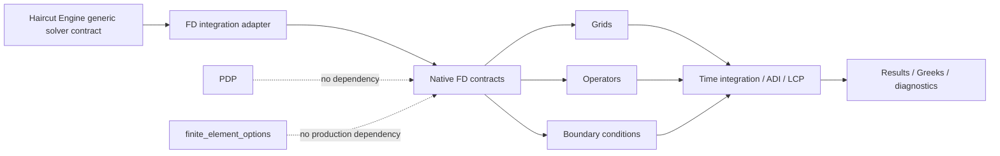

# Finite Difference Options — Architecture Specification

**Status:** Canonical target architecture  
**Audit baseline:** 2026-06-26  
**Repository:** `googa27/finite_difference_options`  
**Default branch:** `main`  
**Portfolio epic:** [`haircut-engine` #62](https://github.com/googa27/haircut-engine/issues/62)  
**Local modernization epic:** [#50](https://github.com/googa27/finite_difference_options/issues/50)

---

## 1. Architectural mission

Finite Difference Options provides reusable and independently verifiable finite-difference mechanisms for parabolic, obstacle and related pricing PDEs. It is a numerical library first; products, APIs, CLIs, UIs, reports and frontend clients are outer adapters.

The core invariant is:

```text
explicit PDE + conventions
        ↓
typed FD problem
        ↓
grid + differential operators + boundary algebra
        ↓
time / ADI / LCP policy
        ↓
solution + Greeks + residual/convergence/performance diagnostics
```

No layer may fabricate coefficients, infer generic boundaries from product strings or hide a solver fallback.

## 2. Federated portfolio context



Repository ownership:

- `finite_difference_options` owns reusable FD numerical mechanisms and FD-specific diagnostics.
- `haircut-engine` owns domain/CASCADE policy, solver routing and portfolio evidence.
- `finite_element_options` owns production FEM mechanisms.
- `PDP` owns data acquisition and data-product contracts.

Cross-repository integration uses versioned wheels, contracts and parity fixtures—not Git submodules or source-tree imports.

## 3. Audit findings and decisions

| Finding | Risk | Decision / owner |
|---|---|---|
| `pyproject.toml` contains only Ruff settings | No installable project metadata, dependency contract or wheel definition | Complete package foundation under #51 |
| Runtime dependencies live only in pinned requirements files | Consumers cannot resolve a published library correctly | PEP 621 runtime ranges plus development lock |
| Public examples import `src.*`; code mixes relative and `src.*` imports | Checkout behavior masks broken installation and split identity | Real package namespace and import cleanup under #51/#52 |
| Legacy and newer processes, pricers, Greeks, boundaries and solvers coexist | Divergent semantics and duplicated fixes | One canonical implementation per capability under #52 |
| `SolverFactory` routes primarily by process dimension | Dimension does not prove coefficient, BC, obstacle or scheme support | Capability predicates and explicit problem contracts |
| `ADISolverWrapper` used to construct dummy drift and hard-coded covariance | Numerically plausible but model-incorrect output | Removed from selectable multidimensional routes under #43; complete ADI splitting and explicit result diagnostics continue under #46/#59 |
| Generic 1D adapter guesses boundary conditions from `option_type` | Product assumptions hidden in numerical core | Typed BCs supplied by problem adapter |
| Core requirements include FastAPI, Typer, Streamlit and plotting | Numerical consumers install unrelated application stacks | Separate published extras |
| SciPy is only in development requirements | Runtime metadata does not match numerical implementation needs | Put actual numerical runtime dependencies in core metadata |
| CI and contributor guidance rely on repository-root state and `.gemini_project` | Non-durable architecture/task source and weak wheel confidence | GitHub/docs/tests authoritative; clean-wheel CI |
| Next.js client shares repository without explicit product boundary | Frontend lifecycle can couple numerical release | Independent app lock/API contract and optional CI |
| `tests/test_unified_pricing_engine.py` was excluded from blocking CI while known regressions existed | Green main could hide unified-engine time-orientation, payoff-broadcasting or incompatible-route debt | Reintroduced under #72 with explicit calendar-time semantics, multidimensional European payoff-broadcast tests and strict issue-linked xfail quarantine for #45/#62 |
| CI and Gemini automation were ambiguous about blocking vs advisory failures | External review quota/auth/tool failures could masquerade as package or numerical failures | `docs/CI_POLICY.md` defines the blocking `CI` workflow, optional Node profile, and advisory Gemini failure classification under #69 |

## 4. Architectural principles

1. **The PDE problem is explicit input.** Coefficients, boundaries, time and measure conventions are never inferred from dimension alone.
2. **Finite-difference mechanics are the core.** Products and interfaces are adapters.
3. **One canonical implementation per capability.** Legacy paths have migration and removal dates.
4. **Boundary and mixed-derivative algebra are first-class.** They are tested independently.
5. **Fail closed.** Unsupported dimensions, coefficients, BCs, obstacles and outputs are rejected before operator construction.
6. **Correctness before performance.** Consistency, stability and convergence precede speed claims.
7. **Small numerical wheel.** API, CLI, UI, plotting and frontend stacks are optional.
8. **Diagnostics are part of the result.** Residual, iterations, reuse and failure state cannot be discarded.
9. **Independent release integration.** Entry points and compatibility matrices replace source-tree coupling.
10. **Durable governance.** GitHub issues, canonical docs, tests and manifests are authoritative.

## 5. Target package topology

```text
src/finite_difference_options/
  __init__.py                  # narrow stable public API
  contracts/
    problem.py                 # domain-neutral PDE records
    configuration.py           # grid, stencil, time and solver policies
    result.py                  # values, Greeks and diagnostics
  grids/
  operators/
  boundary_conditions/
  time_integration/
  solvers/
    one_dimensional.py
    adi.py
    lcp.py
  greeks/
  diagnostics/
  validation/
  integrations/
    haircut_backend.py
  _compat/                     # time-bounded legacy import shims only

api/                           # optional FastAPI application
cli/                           # optional Typer application
apps/                          # optional Streamlit application
nextjs-client/                 # independently locked frontend example
benchmarks/
examples/

tests/
  architecture/
  contract/
  unit/
  integration/
  numerical/
  performance/
```

This is a responsibility map, not a big-bang refactor instruction. Boundaries are justified by dependency direction, semantic ownership, optional installation or independent testing.

## 6. Dependency direction

```text
contracts and diagnostic schemas
             ↑
grids / operators / boundary conditions
             ↑
time integration / one-dimensional / ADI / LCP / Greeks
             ↑
validation and integration adapters
             ↑
API / CLI / UI / frontend / examples
```

Hard rules:

- Contracts cannot import `findiff`, FastAPI, Typer, Streamlit, plotting, frontend code or Haircut.
- Grids/operators/boundaries cannot import products, interfaces, reporting or integration adapters.
- Solvers consume explicit coefficient/operator/boundary records and do not inspect product strings.
- The Haircut adapter imports canonical public FD APIs only.
- API, CLI and UI import the installed package; numerical core never imports them.
- The Next.js client interacts through a versioned service schema only.
- No module imports the distribution as `src`.
- Optional imports are lazy and identify the required extra.
- Architecture tests enforce the graph.

## 7. Mathematical problem contract

A generic linear parabolic problem is represented explicitly:

\[
\partial_\tau u(x,\tau)
= \frac12\sum_{i,j=1}^{d} a_{ij}(x,\tau)\,\partial_{ij}u
+ \sum_{i=1}^{d} b_i(x,\tau)\,\partial_i u
- c(x,\tau)u
+ f(x,\tau),
\]

with domain, coordinate transform, time orientation, initial or terminal condition and boundary data supplied by the caller.

The contract distinguishes:

- covariance/diffusion matrix `A=[a_ij]` and its coordinate convention;
- drift `b`;
- reaction/discount `c`;
- source `f`;
- optional jump, system or obstacle terms;
- requested output time orientation.

No solver may replace absent inputs with dummy zeros, hard-coded variances or product defaults.

## 8. Native contract model

```text
FDProblem
├── state domain and coordinate transforms
├── time interval and orientation
├── drift, diffusion/covariance, reaction and source fields
├── initial/terminal condition
├── typed boundary specifications
├── optional obstacle, jump or system terms
└── units and convention metadata

FDConfiguration
├── grid family, nodes and truncation policy
├── stencil order and upwind/central policy
├── theta, Rannacher, ADI or LCP policy
├── linear solver, tolerances and iteration limits
├── output and Greek requests
└── dtype/device/resource limits

FDResult
├── solution and coordinates
├── point values, Greeks and exercise boundary
├── residual/convergence/complementarity diagnostics
├── covariance, boundary and stability checks
├── operator/factorization reuse and stage timings
├── warnings/regularization/fallback trace
└── version and reproducibility metadata
```

Contracts are immutable or snapshot-able and serialization-tested.

## 9. Grid architecture

Grid APIs declare dimension, coordinate system, monotonic nodes, transforms, truncation/far-field policy and boundary locations. Supported families may include:

- uniform physical-coordinate grids;
- uniform log-coordinate grids;
- nonuniform clustered grids;
- multidimensional tensor-product grids.

Validation checks finite monotone coordinates, minimum node count, spacing ratios, transform invertibility and requested evaluation points. Non-tensor unstructured grids are outside the FD core unless a dedicated method is added.

## 10. Differential operators

Operators are constructed from explicit grid and coefficient records. Each derivative declares order, local stencil, boundary closure and bias.

Rules:

- Uniform and nonuniform coefficients are different implementations or policies, not one formula with an unstated approximation.
- Mixed derivatives use the declared covariance convention and sign.
- Upwinding is selected by a typed policy and local drift criteria where applicable.
- Boundary rows are owned by boundary algebra, not accidental stencil truncation.
- Operator matrices expose sparsity, dimensions and expected consistency tests.
- Use `findiff` only where its semantics are verified and do not prevent required diagnostics or nonuniform formulas.

## 11. Boundary-condition architecture

Typed hierarchy:

```text
BoundaryCondition
├── Dirichlet(value, boundary_set)
├── Neumann(derivative, value, boundary_set)
├── Robin(alpha, beta, value, boundary_set)
├── Periodic(pairing)
└── Asymptotic(formula, validity assumptions)
```

The generic solver never reads `option_type` to choose a boundary. Product adapters translate financial assumptions into explicit BC records before numerical routing.

Tests cover boundary residuals, corners, time dependence, transformed coordinates and incompatibility rejection.

## 12. One-dimensional time integration

Theta-family integration is explicit. For a semidiscrete operator `L`, a representative step is

\[
\left(I-\theta\Delta\tau L_{n+1}\right)u_{n+1}
=
\left(I+(1-\theta)\Delta\tau L_n\right)u_n
+ \Delta\tau\left[\theta f_{n+1}+(1-\theta)f_n\right],
\]

subject to the repository's declared operator sign and boundary algebra.

Time-dependent coefficients require explicit reassembly/reuse policy. Rannacher smoothing is modeled as a start-up sequence, not a Boolean that silently changes the scheme. Stability and temporal convergence are tested independently of spatial error.

## 13. Multidimensional ADI architecture

An ADI policy declares:

- supported dimension;
- operator split into directional and mixed components;
- scheme variant and theta parameters;
- coefficient time/state dependence;
- boundary treatment per substep;
- linear-solver and reuse policy;
- stability/consistency assumptions;
- diagnostics and fallback behavior.

Covariance validation occurs before operator construction. A route must prove the mixed-derivative coefficient and sign using manufactured or analytical cases. The current dummy drift/covariance wrapper cannot be selectable or advertised after migration begins.

## 14. Obstacle/LCP architecture

Obstacle problems add an explicit obstacle `\psi` and complementarity conditions, for example:

\[
u \ge \psi,\qquad
\mathcal{R}(u) \ge 0,\qquad
(u-\psi)\,\mathcal{R}(u)=0.
\]

LCP policies declare PSOR, policy iteration or another validated method, tolerances, iteration limit, relaxation and warm-start behavior. Diagnostics include primal/dual/complementarity residuals and exercise boundary where meaningful.

## 15. Greeks and sensitivities

Finite-difference Greeks are separate from PDE discretization operators but share grid metadata. A result records coordinate transform, stencil/order, one-sided treatment, evaluation/interpolation point, smoothing policy and error evidence.

Nonuniform-grid first and second derivatives use dedicated formulas. Payoff-kink tests distinguish pre-asymptotic behavior, Rannacher effects and smooth-region convergence. Parameter sensitivities by bump-and-resolve disclose bump size and solver tolerance interaction.

## 16. Backend plugin architecture

Candidate entry point:

```toml
[project.entry-points."haircut.solver_backends"]
finite_difference_options = "finite_difference_options.integrations.haircut_backend:create_backend"
```

Adapter lifecycle:

1. Expose lightweight backend identity and capability metadata.
2. Validate solver-contract version, maturity and request compatibility.
3. Map generic records to native immutable FD contracts without reinterpretation.
4. Select only explicit validated native policies.
5. Reject absent coefficients, unsupported BCs or invalid covariance before operator work.
6. Solve and normalize values, Greeks and diagnostics.
7. Record package, contract, benchmark and environment identity.

The adapter imports no Haircut domain/application, PDP or delivery modules and advertises only tested capabilities.

## 17. Canonical implementation consolidation

For every duplicated capability, choose one canonical path based on correctness evidence, API clarity and maintainability. The other path becomes:

- a migration shim with warning and removal version;
- a reference implementation used only in tests; or
- deleted after golden/parity coverage.

Inventory at minimum:

- stochastic process interfaces and coefficient extraction;
- instruments/payoffs and product adapters;
- one-dimensional solvers and time steppers;
- ADI implementations;
- boundary-condition classes;
- Greek calculators;
- plotting and reporting helpers;
- old and unified pricer facades.

Do not merge implementation variants by adding more conditional branches to one god object. Separate stable contracts from method-specific implementations.

## 18. Delivery architecture

Python core is the source of numerical truth. Outer applications follow:

```text
interface schema → application adapter → public FD API → result DTO
```

- CLI is a Typer extra and contains no numerical formulas.
- FastAPI is an API extra with bounded schemas/work and cancellation.
- Streamlit is a UI extra rendering public result DTOs.
- Plotting is a visualization extra.
- Next.js has its own package lock and consumes a versioned API schema.
- Regulatory report endpoints remain examples unless domain ownership and validated specifications are established elsewhere.

## 19. Packaging and dependency profiles

Use PEP 621 metadata with explicit build backend, `requires-python`, bounded runtime dependencies, package discovery under `src`, extras, scripts/entry points, license and project URLs.

Core includes actual numerical runtime dependencies. If SciPy sparse solvers are used at runtime, SciPy belongs in core metadata rather than development-only requirements. `findiff` remains only if canonical routes validate its behavior and it does not block required diagnostics or nonuniform support.

Publishable profiles: `api`, `cli`, `ui`, `viz`, `validation` and `docs`. Test, lint, typing, build and audit packages belong in dependency groups. A checked lock reproduces development CI; wheel metadata uses compatible ranges.

## 20. Performance architecture

Optimization order:

1. Establish manufactured/analytical correctness and observed order.
2. Profile grid/operator construction, boundary application, factorization, solve/ADI substeps, Greeks and serialization.
3. Remove repeated construction, dense conversion and unnecessary histories.
4. Reuse operators/factorizations with complete cache keys.
5. Compare stencil, linear-solver and ADI policies at equal error.
6. Establish noise-aware regression budgets.

Benchmark metadata includes problem/grid/config hash, dimensions and node counts, nonzeros, time steps, package versions, hardware/BLAS/threads, dtype/device, cold/warm/cache state, stage timings, memory, iterations/residuals and achieved error.

## 21. Validation architecture

| Layer | Purpose |
|---|---|
| Architecture | Import boundaries, canonical namespace, optional application isolation |
| Contract | Problem/config/result serialization and compatibility |
| Unit | Grids, stencil coefficients, boundary algebra, step matrices and failure paths |
| Numerical | Manufactured/analytical solutions, convergence, invariants, ADI and Greeks |
| Integration | End-to-end problem→operator→solve→result and optional apps |
| Parity | Shared Haircut backend fixtures from `googa27/haircut-engine#64` |
| Performance | Accuracy-adjusted stage/memory regressions |
| Packaging | sdist/wheel content, clean install and missing-extra behavior |

Default tests are deterministic and offline. Frontend and service tests are separate from numerical-core tests.

## 22. Architecture fitness gates and CI release topology

The baseline gate for #60 is `pytest -q tests/architecture`. It is intentionally ratcheted: it records the current transitional `src/*` surface, enforces the rule **No new root package under `src/`** unless `docs/ARCHITECTURE.md` and the gate baseline are updated, and prevents numerical-core modules from importing API, CLI, UI or plotting stacks.

After package foundation #51 lands, the architecture gate must add the hard `src.*` import ban, package install/import smoke tests, and `deptry` or equivalent dependency-drift checks against PEP 621 metadata. Those follow-on checks are not optional; they are sequenced because the repository does not yet publish runtime metadata.

| Job | Purpose | Policy |
|---|---|---|
| Core minimum | Clean wheel at minimum supported Python/dependencies | Blocking |
| Core latest | Latest compatible core | Blocking |
| Numerical baseline | Manufactured, BS, convergence, BC and Greek tests | Blocking |
| Multidimensional | Real-coefficient ADI and mixed-term tests | Blocking when advertised |
| Obstacle | LCP/complementarity tests | Blocking when advertised |
| Package architecture | Public namespace and dependency contracts | Blocking |
| API/CLI/UI | Optional application schema/smoke tests | Changed/scheduled |
| Frontend | Independent install/build/API-contract test | Changed/scheduled |
| Haircut parity | Clean-wheel plugin and shared fixtures | Blocking for compatibility changes |
| Performance | Stable benchmark artifact | Regression policy |
| Release | Build, wheel inspection, SBOM, vulnerabilities and licenses | Release blocking |

One Python version and one all-application environment do not establish library support.

## 23. Compatibility and deprecation policy

No compatibility shim may become a second implementation. The policy below is the issue #60 successor/predecessor map for package migration: #51 introduces the replacement namespace, #52 consolidates predecessor imports into one canonical implementation per capability, and #59 connects the Haircut backend only through the replacement public API.

- Distribution API and Haircut solver-contract versions are independent.
- The compatibility matrix is owned by `googa27/haircut-engine#65` and referenced in release notes.
- Unknown combinations are unsupported.
- Public deprecations name replacement, warning version, removal version/date and migration example.
- Shims contain no new numerical behavior.
- Breaking operator, boundary, time, ADI/LCP or Greek semantics require explicit versioning and migration fixtures.

## 24. Migration plan

### Phase 0 — Prevent new coupling

- No new `src.*` public imports, product-boundary guessing, placeholder coefficients or mandatory application dependencies.
- Add characterization tests before moving code.

### Phase 1 — Package foundation

- Implement #51: full `pyproject.toml`, canonical namespace, wheel metadata and clean-install CI.
- Add architecture contracts and public symbol inventory.
- Move development tools to dependency groups and optional applications to extras.

### Phase 2 — Canonical module inventory

- Implement #52 inventory of processes, pricers, operators, BCs, Greeks and solvers.
- Choose one implementation per capability.
- Add `_compat` shims only for known public imports.

### Phase 3 — Explicit numerical contracts

- Replace dimension-only routing with typed capability predicates.
- Remove dummy coefficient and product-boundary inference from selectable routes.
- Complete numerical blockers #42–#58.

### Phase 4 — Applications as adapters

- Make CLI, API and Streamlit consume the installed package.
- Give Next.js an independent API contract and CI.
- Keep report examples outside numerical ownership.

### Phase 5 — Backend integration

- Implement #59 entry-point adapter.
- Run shared Haircut conformance/parity from installed wheels.
- Publish compatibility under Haircut #65.

### Phase 6 — Release maturity

- Establish minimum/latest/profile CI, accuracy-adjusted performance budgets and supply-chain evidence.
- Remove legacy imports only after deprecation windows and downstream evidence.

## 25. Architecture decisions

| ADR | Decision | Rationale |
|---|---|---|
| FD-ADR-001 | Real `finite_difference_options` package under `src`; `src` is not public | Correct wheel behavior |
| FD-ADR-002 | PDE coefficients and BCs are explicit problem inputs | Prevent model-incorrect placeholder output |
| FD-ADR-003 | Capability routing replaces dimension-only selection | Dimension alone does not establish support |
| FD-ADR-004 | One canonical implementation per numerical capability | Reduce semantic drift and maintenance cost |
| FD-ADR-005 | API, CLI, UI, plotting and frontend are optional outer applications | Small numerical wheel |
| FD-ADR-006 | Entry-point plugin for Haircut integration | Independent releases and lazy discovery |
| FD-ADR-007 | Accuracy and convergence precede performance | Numerical credibility |
| FD-ADR-008 | Compatibility shims are time-bounded boundary code | One source of numerical truth |
| FD-ADR-009 | GitHub/docs/tests are authoritative, not agent databases | Durable governance |
| FD-ADR-010 | Profile-specific CI replaces one application-wide environment | Honest support and dependency isolation |

## 26. Issue map

- Numerical correctness and API semantics: #42–#49
- Modernization epic: #50
- Package foundation and imports: #51
- Canonical implementation consolidation: #52
- API/capability/documentation contracts: #53–#55
- Rannacher, nonuniform Greeks and refinements: #56–#58
- Haircut backend adapter: #59
- Portfolio protocol/parity/release: `haircut-engine` #62–#65

## 27. References

- PyPA project metadata: https://packaging.python.org/en/latest/guides/writing-pyproject-toml/
- PyPA `src` layout: https://packaging.python.org/en/latest/discussions/src-layout-vs-flat-layout/
- PyPA plugin discovery: https://packaging.python.org/en/latest/guides/creating-and-discovering-plugins/
- Python `importlib.metadata`: https://docs.python.org/3/library/importlib.metadata.html
- uv dependencies and groups: https://docs.astral.sh/uv/concepts/projects/dependencies/
- SciPy sparse linear algebra: https://docs.scipy.org/doc/scipy/reference/sparse.linalg.html
- NumPy numerical gradient: https://numpy.org/doc/stable/reference/generated/numpy.gradient.html

---

*End of canonical Finite Difference Options architecture specification.*
